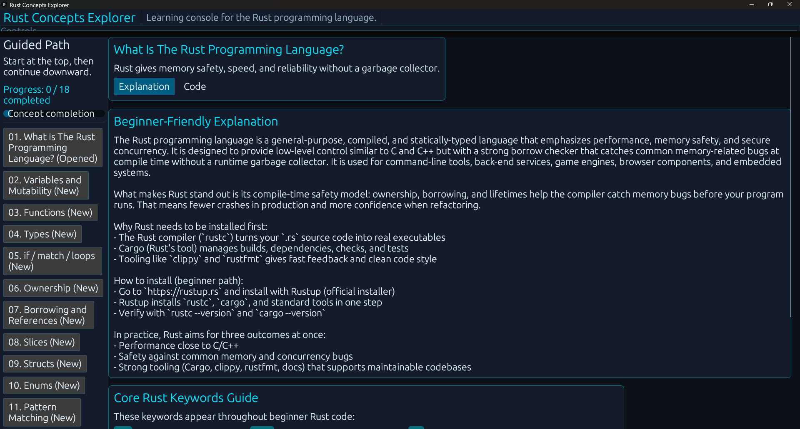

# Rust Concepts Explorer



Rust Concepts Explorer is a desktop GUI app that teaches core Rust programming concepts in an interactive, beginner-friendly format.

Instead of dropping a new learner into a wall of syntax, the app presents Rust as a guided learning path. Users can move through concepts like variables, functions, types, ownership, borrowing, pattern matching, error handling, modules, traits, lifetimes, and Cargo while reading explanations, viewing code, and triggering visual state changes that reinforce what the code is doing.

## What this app does

- Presents Rust concepts in a guided sidebar learning path
- Includes explanation and code views for each concept
- Uses clickable teaching snippets to show code changes tied to specific Rust ideas
- Includes an ownership and borrowing visualizer
- Includes a module-system deep dive for `mod`, `pub`, `crate`, and `use`
- Tracks concept completion so learners can measure progress
- Supports light/dark mode, zoom controls, and adjustable text size for readability

## Why this project is cool

This is not just a GUI shell with text dumped into it. The app is structured to *teach through interaction*.

It shows how a Rust desktop application can also be a teaching tool:

- the codebase itself demonstrates modules, enums, structs, shared state, and UI composition
- the interface reinforces Rust ideas visually instead of only describing them
- the content is organized in a way that helps beginners build a mental model step by step

For someone learning Rust, this makes the language feel less abstract and more usable.

## Built with

- Rust
- `eframe`
- `egui`

## Project structure

A typical layout for this project should look like this:

```text
.
├── Cargo.toml
└── src
    ├── main.rs
    ├── app.rs
    ├── content.rs
    ├── models.rs
    ├── navigation.rs
    ├── theme.rs
    └── ui
        ├── mod.rs
        ├── components.rs
        ├── concept_view.rs
        ├── visualizer.rs
        ├── home.rs
        └── code_walkthrough.rs
```

## How to run the code

### 1. Clone the repository

```bash
git clone <your-repo-url>
cd <your-repo-folder>
```

### 2. Make sure Rust is installed

Check that Cargo is available:

```bash
cargo --version
```

If Rust is not installed yet, install it with the standard Rust toolchain installer from the Rust project website.

### 3. Run the app

From the project root:

```bash
cargo run
```

Cargo will download dependencies, compile the project, and launch the desktop application.

## Build a release version

```bash
cargo build --release
```

The optimized executable will be generated in:

```text
target/release/
```

## Helpful development commands

Check the code without producing a release binary:

```bash
cargo check
```

Run tests:

```bash
cargo test
```

Format the code:

```bash
cargo fmt
```

Lint the project:

```bash
cargo clippy
```

## Notes

- This project is intended as a Rust learning app, not just a generic GUI demo.
- If you downloaded the source files individually instead of cloning the repo, make sure the files are placed into the correct `src/` and `src/ui/` folders so the module declarations resolve properly.

## Future ideas

- Add more concept visualizers
- Add code execution or compile-feedback demos
- Add quizzes or challenge modes
- Add progress persistence between sessions
- Add beginner and advanced learning paths

## License

```text
MIT
```
